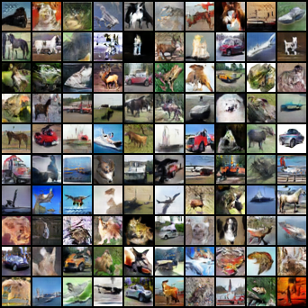

# Code for a [Variational Inequality Perspective for Generative Adversarial Networks](https://arxiv.org/abs/1802.10551)

## Requirements

The code is in `pytorch` and was tested for:
- pytorch=0.4.0

The inception score is computed using the original implementation from OpenAI [](https://github.com/openai/improved-gan/tree/master/inception_score), and thus requires `tensorflow` <= 1.5.0 to be installed.

A conda environement is also provided (requires CUDA 9):
`conda env create -f environment.yml`

## `class Extragradient`

The extragradient method is packaged as a `torch.optim.Optimizer` with an additional method `extrapolation()`. Two variants are available `ExtraSGD` and `ExtraAdam`.

Example of how to run `Extragradient`:
```python
for i, input, target in enumerate(dataset):
    Extragradient.zero_grad()
    output = model(input)
    loss = loss_fn(output, target)
    loss.backward()
    if i%2:
      Extragradient.extrapolation()
    else:
      Extragradient.step()
```

Example of how to run `Extragradient` from the past:
```python
for i, input, target in enumerate(dataset):
    PastExtragradient.extrapolation()
    PastExtragradient.zero_grad()
    output = model(input)
    loss = loss_fn(output, target)
    loss.backward()
    PastExtragradient.step()
```
Note that for `Extragradient` from the past the extrapolation is done before computing the forward and the backward pass.

## Experiments

To run the WGAN-GP experiment with ExtraAdam and the ResNet architecture on CIFAR10 with the parameters from the paper:
`python train_extradam.py results\ --default --model resnet`

The `--default` option loads the hyperparameters used in the paper for each experiments, they are available as JSON files in the `config` folder.

The weights for our WGAN-GP and ResNet model trained with ExtraAdam is available in the `results` folder.

For evaluation:
`python eval_inception_score.py results/ExtraAdam/best_model.state`

A `ipython` notebook is also available for the bilinear example [here](bilinear_wgan.ipynb).

## Results
with Averaging:


without Averaging:


